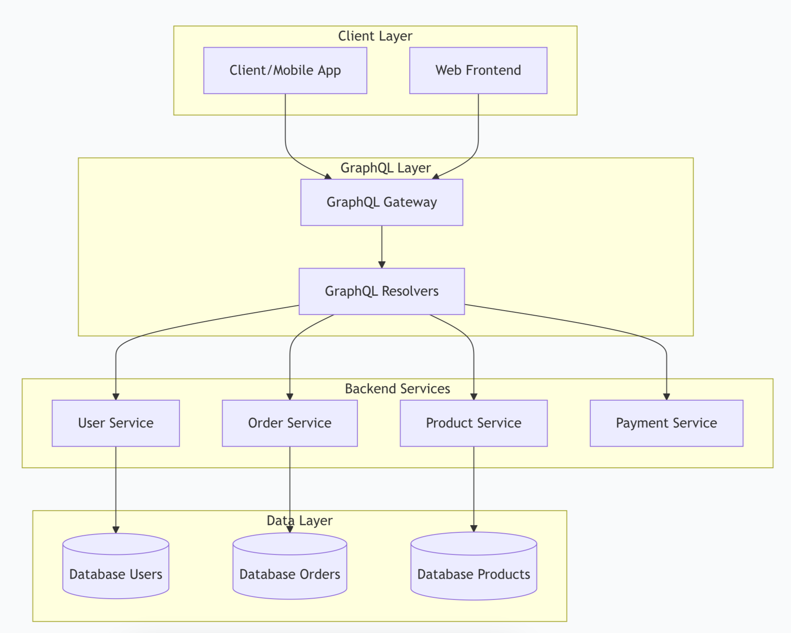

# TUGAS UTS

**NAMA: RENDI ALFIAN**  
**NIM: 245410080**  

## 1.⁠ ⁠Jelaskan teorema CAP dan BASE dan keterkaitan keduanya. Jelaskan menggunakan contoh yang pernah anda gunakan.
```
Teorema CAP menjelaskan tiga sifat dalam sistem terdistribusi, yaitu konsistensi, 
ketersediaan, dan toleransi partisi. Sistem tidak bisa menjamin ketiganya sekaligus 
jika jaringan terbelah. Saat partisi terjadi, sistem hanya bisa mempertahankan dua sifat. 
Contoh yang pernah saya gunakan ada pada konfigurasi primary dan replica di PostgreSQL. 
Jika koneksi antar node putus, primary harus memilih tetap konsisten atau tetap tersedia.

Kita memahami BASE sebagai pendekatan yang memberi ruang bagi keterlambatan 
sinkronisasi data. BASE menekankan ketersediaan dan menerima bahwa data bisa 
berubah secara bertahap sampai konsisten. Pendekatan ini muncul pada sistem yang 
harus terus melayani permintaan meskipun ada perbedaan kecil antar node. Saat kita 
memakai replica PostgreSQL dalam mode asinkron, data di replica tidak langsung sama 
dengan primary. Namun data akan menyusul.

Keterkaitan CAP dan BASE terlihat dari pilihan arsitektur saat kita membangun sistem terdistribusi. 
Jika kita memilih replikasi sinkron, kita memprioritaskan konsistensi dan toleransi partisi. 
Namun ketersediaan bisa turun karena primary menunggu replica. Jika kita memilih replikasi asinkron, 
kita memprioritaskan ketersediaan. Data menyusul kemudian, sesuai prinsip BASE yang mengutamakan
kelancaran layanan.
```

### CAP dengan Contoh: Layanan Stok E-Commerce
Bayangkan sebuah sistem yang menyimpan jumlah stok barang di dua server: **Server A** dan **Server B**. Keduanya harus selalu sinkron karena banyak pengguna melakukan pemesanan secara paralel.

Suatu saat terjadi **network partition**, sehingga Server A tidak dapat berkomunikasi dengan Server B.

Pada kondisi inilah **CAP** mulai berlaku:

### Jika memilih *Consistency (CP)*:
Ketika pengguna mencoba membeli barang melalui Server A, sistem akan **menolak atau menunda** permintaan sampai koneksi ke Server B pulih.

> ➜ Stok tetap akurat, tetapi pengguna mungkin tidak bisa checkout.

### Jika memilih *Availability (AP)*:
Server A tetap melayani permintaan dan mengurangi stok lokalnya meskipun tidak bisa mendapat data terbaru dari Server B.

> ➜ Sistem tetap responsif, tetapi stok bisa menjadi tidak konsisten sementara.

### Asumsi yang perlu diuji:
Banyak orang mengira trade-off ini berlaku setiap saat. Padahal, **CAP hanya memaksa kita memilih pada saat terjadi gangguan jaringan**.  
Dalam kondisi normal, *consistency* dan *availability* dapat berjalan bersama.

---

### BASE dengan Contoh: Stok yang *Eventually Consistent*
Masih memakai skenario yang sama.

Jika sistem memilih jalur **AP**, maka pendekatan praktis yang digunakan adalah **BASE**, yang menjaga agar layanan tetap berjalan meskipun terjadi ketidaksinkronan sementara.

### Basically Available
Server A dan Server B tetap melayani permintaan meskipun koneksi antar server terputus.

### Soft State
Selama terjadi gangguan, nilai stok di kedua server **boleh tidak sama**. Keadaan sistem dapat berubah meski tanpa input pengguna.

### Eventual Consistency
Ketika koneksi pulih, kedua server akan melakukan **sinkronisasi** sehingga stok kembali konsisten.

### Uji Penalaran:
Apakah pendekatan ini aman?  
Untuk barang yang stoknya sedikit atau bernilai tinggi, pendekatan AP+BASE dapat menyebabkan **overselling**.  
Karena itu, BASE cocok untuk domain yang bisa mentoleransi ketidakkonsistenan jangka pendek, misalnya *feed media sosial*, tetapi tidak ideal untuk transaksi finansial atau inventori kritis.

---

### Keterkaitan CAP dan BASE pada Contoh yang Sama
Masih dengan contoh layanan stok:

- **CAP** memberikan batasan teoretis:  
  Saat server A dan B terpisah karena gangguan jaringan, **kamu tidak bisa mendapatkan Consistency dan Availability sekaligus**.

- **BASE** adalah solusi praktis ketika sistem memilih jalur **AP (Availability + Partition Tolerance)**:  
  Data boleh tidak konsisten sementara, namun akan menjadi konsisten kembali setelah sinkronisasi.

### Intinya:
- **CAP = hukum alam sistem terdistribusi**  
  (apa yang *tidak mungkin* dicapai secara bersamaan saat terjadi partition).

- **BASE = strategi rekayasa untuk hidup dengan batasan tersebut**  
  (bagaimana membuat sistem tetap berguna meski ada ketidakkonsistenan sementara).

### Asumsi yang perlu dikoreksi:
BASE bukan “lebih buruk” dari ACID.  
BASE adalah kompromi rasional ketika:
- skala besar,
- latency rendah,
- dan availability tinggi  
lebih penting daripada konsistensi instan.

---
## 2.⁠ ⁠Jelaskan keterkaitan antara GraphQL dengan komunikasi antar proses pada sistem terdistribusi. Buat diagramnya. 
```
1. GraphQL Bukan Mekanisme IPC
Pertama-tama, penting untuk meluruskan asumsi umum:  
GraphQL bukan protokol komunikasi antar proses (Inter-Process Communication / IPC).

GraphQL adalah *query language dan API interface yang digunakan di antara client ↔ API Gateway/Backend.  
Sementara IPC pada sistem terdistribusi terjadi di antara service ↔ service, menggunakan mekanisme seperti:
- gRPC  
- REST internal  
- Message Queue (Kafka, RabbitMQ)  
- Event streaming  
- Shared memory atau pipes (di level OS)

Artinya, GraphQL tidak menggantikan IPC dan tidak berfungsi sebagai protokol antar microservices.

2. Bagaimana GraphQL Bersentuhan dengan IPC melalui API Gateway
Walaupun bukan IPC, GraphQL sering muncul di atas arsitektur sistem terdistribusi.  
Biasanya melalui raphQL Gateway** atau API Orchestrator.
```


## 3.⁠ ⁠Dengan menggunakan Docker / Docker Compose, buatlah streaming replication di PostgreSQL yang bisa menjelaskan sinkronisasi. Tulislah langkah-langkah pengerjaannya dan buat penjelasan secukupnya.
```


```
